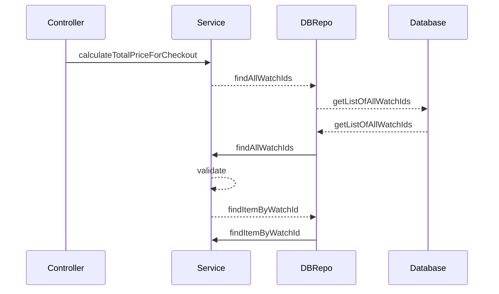

# Shopping Cart

# Contents Overview
* [1. Functional requirements](#1-functional-requirements)
* [2. Development environment](#2-development-environment)
* [3. Software Architecture](#3-software-architecture)
* [4. Deployment](#4-deployment)
* [5. Swagger](#5-swagger)
---

# 1.Functional Requirements:  
Build a simple e-commerce application with a single endpoint that performs a checkout action.
The single endpoint should take a list of watches and return the total cost. The solution is made in Java.

Watch catalogue
Below is a catalogue of four watches and their associated prices:

|Watch ID| Watch Name   | Unit price | Discount |
|---|---|------------|----------|
| 001  | Rolex  | 100           |     3 for 200     |
| 002  | Michael Kors  | 80           |     2 for 120     |
| 003  | Swatch  |   50         |          |
| 004  | Casio  |    30        |          |


There are a few requirements worth noting here:
1. The first two products have a possible discount. As an example, if the user attempts
to check out three or six Rolex watches then they will receive the discount price once
or twice, respectively. 
2. There is no limit to the number of items or combinations of watches a user
can checkout.
3. There is no limit to the number of times a discount can be used.
4. Similarly, a user can checkout a single item if they wish.

Endpoint reference
As a further guideline here's an endpoint definition that you can use to design your API endpoint.
Request
POST http://localhost:8080/checkout
### Headers
Accept: application/json
Content-Type: application/json
### Body
[
"001",
"002",
"001",
"004",
"003"
]
Response
### Headers
Content-Type: application/json
### Body
{ "price": 360 }

# 2. Development Environment  
# Prerequisites

### Java - JDK21.
### Maven - Maven 3.5
### Latest versions of Docker desktop or Kolima.

## Build and run project locally
1. Please make sure you have Java 21 and is set as JAVA_HOME. You shall also have Maven 3.5 or over. On mac include following line within your .bash_profile:
   export JAVA_HOME=/Library/Java/JavaVirtualMachines/temurin-21.jdk/Contents/Home
   export MAVEN_HOME=/Users/jeeveshmishra/apache-maven-3.5.0/bin
2. You shall have either Docker or Kolima installed on your mac.
3. Then run command from your home folder: source ~/.bash_profile
4. Build project from command line using command 
```shell 
./mvn clean install 
```
 from the project root folder.
5. At command line from root folder we can run 
```shell 
./mvn spring-boot:run 
```

to run the application locally.
6. Swagger is accessible at URL: http://localhost:8080/swagger-ui/index.html#


# 3. Software Architecture


## Flow Diagram



# 4. Deployment

Ideally I prefer the Github actions as its more declarative , with good documentation and concise to make CI/CD flows in comparison to what we use in internal applications if HB (Jenkins).

I would like to deploy it on Azure paltform using terraforms if the ecosystem is supported.

# 5. Swagger

Swagger is accessible at URL: http://localhost:8080/swagger-ui/index.html#